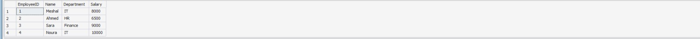
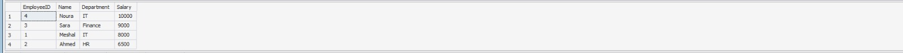

# HR Analytics Project (SQL)

## 📊 Project Overview
This project analyzes HR employee data using SQL to extract meaningful insights about salaries, departments, and employee distribution.

---

## 🛠️ Tools Used
- SQL

---

## 📈 Analysis Performed
- Total number of employees
- Average salary calculation
- Highest and lowest salary detection
- Department-wise salary analysis
- Salary classification (High / Medium / Low)
- Ranking departments by salary

---

## 🔍 Key Insights
- IT department has the highest average salary
- HR department has the lowest salary range
- Salary distribution is mainly in Medium category
- Clear differences between departments were identified

---

## 📊 Sample Query Results
### Employees Data

### Salary Ranking

### Salary Categories

---

## 📌 Conclusion
This project demonstrates basic SQL data analysis skills including aggregation, grouping, and data classification. It serves as a foundation for HR analytics and business intelligence projects.
